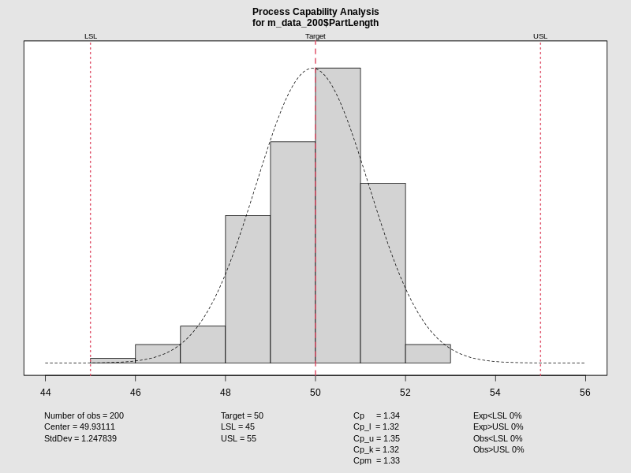
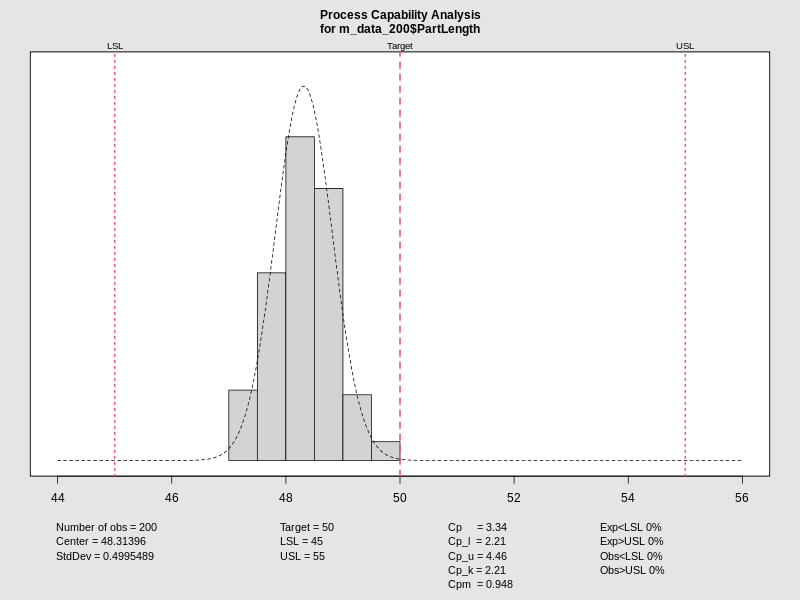
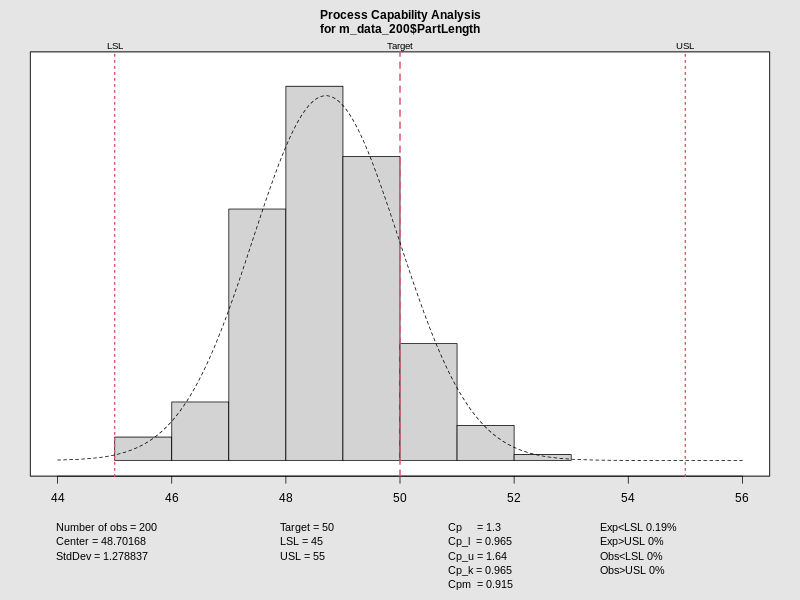

:::: {.columns}
::: {.column width="50%"}

## Quality Control Report
### Subgroup Analysis (N=200)
#### Machine Comparison

::: 

::: {.column width="50%"}

::: 

::::

---

:::: {.columns}
::: {.column width="50%"}
### Machine 1 Stability
**Control Chart (I-Chart):**
- Sample size: 200 groups.
- Monitoring individual deviations.
::: 

::: {.column width="50%"}
<iframe data-src='media/plots/control_chart_m1.html' width='100%' height='500px' style='border:none;'></iframe>
::: 
::::

---

:::: {.columns}
::: {.column width="50%"}
### Machine 1 Capability
**Process Analysis:**
- Evaluation of $C_{pk}$ stability.
::: 

::: {.column width="50%"}

::: 
::::

---

:::: {.columns}
::: {.column width="50%"}
### Machine 2 Stability
**Control Chart (I-Chart):**
- Standardized 200-group view.
::: 

::: {.column width="50%"}
<iframe data-src='media/plots/control_chart_m2.html' width='100%' height='500px' style='border:none;'></iframe>
::: 
::::

---

:::: {.columns}
::: {.column width="50%"}
### Machine 2 Capability
**Process Analysis:**
- Distribution vs Specifications.
::: 

::: {.column width="50%"}

::: 
::::

---

:::: {.columns}
::: {.column width="50%"}
### Machine 3 Stability
**Control Chart (I-Chart):**
- 200 groups analysis.
::: 

::: {.column width="50%"}
<iframe data-src='media/plots/control_chart_m3.html' width='100%' height='500px' style='border:none;'></iframe>
::: 
::::

---

:::: {.columns}
::: {.column width="50%"}
### Machine 3 Capability
**Process Analysis:**
- Final audit of Machine 3.
::: 

::: {.column width="50%"}

::: 
::::
